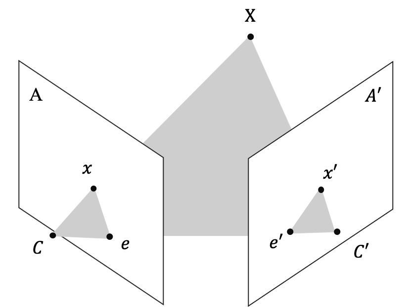
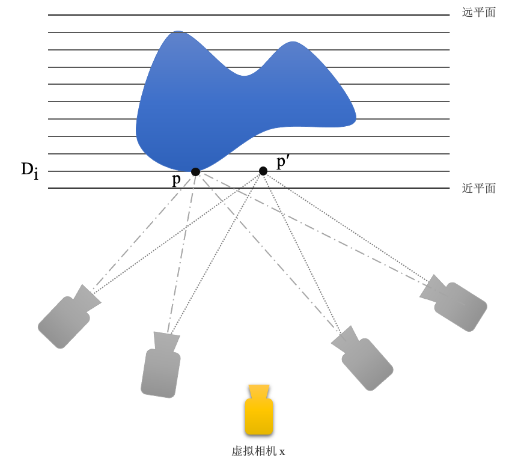
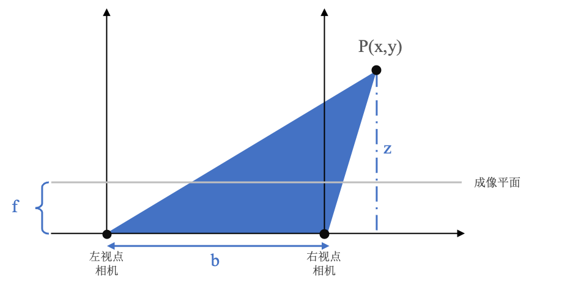
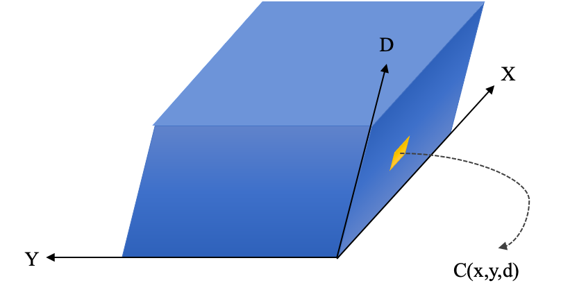
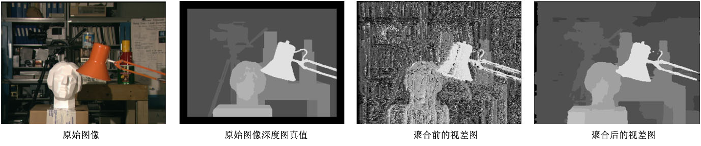
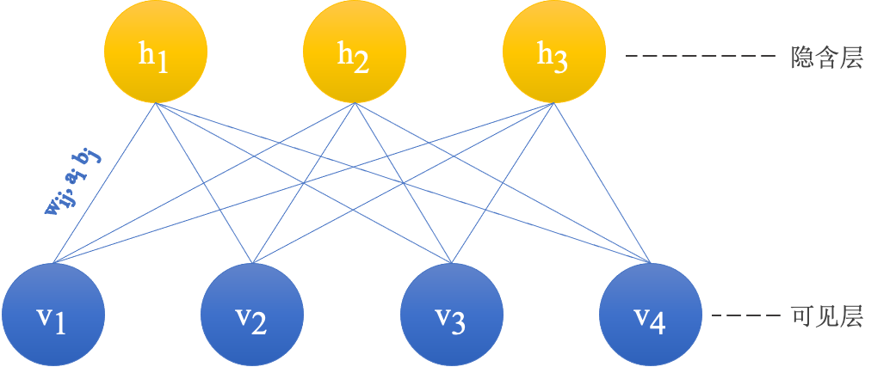

# 第二章 理论基础

* [2.1 三维重建基础知识](#21-三维重建基础知识)
   * [2.1.1 对极几何](#211-对极几何)
   * [2.1.2 单应变换](#212-单应变换)
   * [2.1.3 平面扫描](#213-平面扫描)
   * [2.1.4 立体匹配](#214-立体匹配)
* [2.2 深度学习方法基础知识](#22-深度学习方法基础知识)
   * [2.2.1 卷积神经网络](#221-卷积神经网络)
   * [2.2.2 无监督深度学习](#222-无监督深度学习)

------

## 2.1 三维重建基础知识

​	本部分将介绍立体匹配、深度估计、三维重建领域的基础背景知识，主要介绍立体视觉建模中通过对极几何进行表示的方法、多视点图像间的单应变换及投影问题、平面扫描方法进行校准后图像中像素的深度估计，以及双目视觉三维重建和多目视觉三维重建的立体匹配问题。

### 2.1.1 对极几何

​	对极几何（Epipolar Geometry）是对立体视觉建模的一种约束，通过此建模方法使得立体匹配或深度估计问题存在一个最优解。对极几何的示意图如2.1所示，$X$代表三维空间中的某研究点，$C, C'$表示两摄影机中心，$A,A'$代表两成像平面，$x, x'$分别表示$X, X'$在相机成像平面内的投影。图中两摄像机光心的连线$CC'$称为基线，包含基线的平面$CXC'$称为该观察对象的对极平面，摄像机中心在另一幅视图中的像，即基线与两成像平面的交点称为对极点，图中以$e,e'$所示，对极平面与成像平面的交点$xe, x'e'$称为对极线。

> 图2.1 对极几何示意图

​	需要注意的是，对极几何描述的是两视图间的内在射影关系，只与相机内参和两视图间的相对姿态有关，不依赖外部场景。因此，如果世界中的某研究对象$X$在成像平面$A$上的像点$x$已知，则$X$在另一个构成对极平面的成像平面$A'$上的像点必然在极线$x'e'$上，通过上述极限约束可以大大缩小特征点匹配时的搜索范围。通过对极几何的建模，使得对应点匹配从整幅图像上的寻找压缩到在一条直线上的寻找。

### 2.1.2 单应变换

​	单应变换（Homography）是将空间中的点变换到另一个空间中的投影方式，广泛地用于图像变换中。由单应变换衍生出的单应变换矩阵的一般形式可以表示为
$$
H=\left[\begin{array}{lll}
h_{11} & h_{12} & h_{13} \\
h_{21} & h_{22} & h_{23} \\
h_{31} & h_{32} & h_{33}
\end{array}\right]
$$
​	在图2.1中，假设相机$C$和$C'$间存在旋转$R$和位移$t$，则在对应成像平面上的像点存在关系：$x' = Rx + t$。由此，单应变换矩阵$H$可以通过公式2.2进行表达，其中$d$可理解为相机$C$距观察点的垂直高度，而$n$代表该平面的法向量。
$$
H = K(R + \frac{1}{d}tn^T)K^{-1}
$$
​	在代数中，假设单应变换矩阵$H$将一张图像上的点$a=(x,y,1)$映射到另一张图像上的坐标点$a'=(x',y',1)$，根据单应变换的性质和特点可知$a' = H a^T$，将其展开并进行变换可得公式2.3。
$$
\left[\begin{array}{ccccccccc}-x & -y & -1 & 0 & 0 & 0 & x x' & y x' & x' \\ 0 & 0 & 0 & -x & -y & -1 & x y' & y y' & y'\end{array}\right]h = 0
$$
​	其中将h为9维列向量$h=\left[h_{11}, h_{12}, h_{13}, h_{21}, h_{22}, h_{23}, h_{31}, h_{32}, h_{33}\right]^{T}$，如令
$$
A = \left[\begin{array}{ccccccccc}-x & -y & -1 & 0 & 0 & 0 & x x' & y x' & x' \\ 0 & 0 & 0 & -x & -y & -1 & x y' & y y' & y'\end{array}\right]
$$
​	则公式2.3可简化为
$$
Ah = 0
$$
​	由于单应变换中采用齐次坐标表示平面上的点，所以存在非零标量$s$，使得$b = sHa^T$与$b' = sHa^T$表示同一点$b$，若令$s = \frac{1}{h_{33}}$，则单应变换矩阵的最后一项系数为1，自由度（Degree of Freedom，简称dof）为8。因此只需两幅图像中的4个点对，就可以求解线性方程组的方式解得两图像间的单应变换关系。如果对应点对多于4对，可以通过最小二乘法求解单应变换矩阵，或通过将矩阵$A$进行SVD分解，即$A = U \times \Sigma \times V^T$，取$V$的最后一列作为对应点求解h。

### 2.1.3 平面扫描

​	平面扫描（Planning Sweeping）方法通将对多台相机对场景中物体拍摄得到的经过校准后的图像进行建模，通过单应变换和构建损失函数的方法，求得平面中点在真实物理空间的深度。平面扫描方法基于所有物体只有漫反射的假设，且不考虑场景中的光照变换，构建近平面、远平面和虚拟相机，并将物体用一系列等间距的密集平面进行划分。平面扫描的示意图如图2.2所示。

> 图2.2 平面扫描示意图

​	如果平行平面划分的足够精细，则物体表面的任意一点$p$一定在某一平面$D_i$上，则可以看到该点$p$的相机记录的图像像素值必定相等，而与$p$在同一平面的另一点$p'$并不位于物体表面，则投影到各个相机上的像素值不同。因此平面扫描算法假设：对于平面上的任意点$p$，如果其投影到每个相机上的像素值均相同，则该点很大概率上是物体表面的点。

​	平面扫描算法主要包括两个核心步骤：

（1）将平行平面$Di$上的每个点投影到所有相机上，根据投影得到的像素值进行匹配计算，得分越高，则表示投影在各个相机上的像素越接近，此估计的深度值越精准

（2）将得分高的点再投影到虚拟相机$x$上，并从后到前扫描平面，如果某一平面$D_j$上的点$q$投影到虚拟相机上的得分高于之前的分数，则更新该点的深度和分数，直至平面扫描结束

​	在实际问题中，由于光照和噪声等影响，往往不仅使用像素值，还需要结合窗口信息进行比较，并使用损失函数进行优化，公式如下所示，其中$W$代表以$x,y$为中心的窗口，$\beta$为增益因子。
$$
\begin{aligned}
C\left(x, y, \Pi_{k}\right) &=\sum_{k=0}^{N-1} \sum_{(i, j) \in W} \mid I_{r e f}(x-i, y-j)-\beta_{k}^{r e f} I_{k}\left(x_{k}-i, y_{k}-j\right) \mid
\end{aligned}
$$

​	根据损失函数可以通过公式2.7计算各个点在系列平面的最小值，并使用公式2.8计算该点在物理空间的深度
$$
\tilde{\Pi}(x, y)=\underset{\Pi_{m}}{\operatorname{argmin}} C\left(x, y, \Pi_{m}\right)
$$

$$
Z_{m}(x, y)=\frac{-d_{m}}{\left[\begin{array}{cc}
x & y & 1
\end{array}\right] K_{r e f}^{-T} n_{m}}
$$

### 2.1.4 立体匹配

​	立体匹配（Stereo Matching）也称视差估计或双目深度估计，通过一对在同一时刻捕捉的，并经过极线校正过的左右视图，估计参考图像每个像素对应的深度值，如图2.3所示。

> 图2.3 立体匹配示意图

​	图中$b$代表两相机光心的距离，$f$表示相机光心到成像平面的焦距，$d$为两相机的视差，根据摄影测量和三角形相似等知识可以推导出计算深度的公式如公式2.9所示。
$$
z = \frac{b \times f}{d}
$$
​	而在具体实现时主要分为四个步骤：

（1）匹配代价计算：通过匹配代价函数计算待匹配像素和候选像素间的相关性，其中代价越小说明相关性越大。算法将视差搜索范围限定在$D_{min} \sim D_{max}$之间，对于参考图像中的每个像素，用一个$W \times H \times D$维的三维矩阵，存储视差范围内每个像素的匹配代价。该三维矩阵称为视差空间构象（Disparity Space Image，简称DSI），示意图如图2.4所示。

> 图2.4 DSI示意图

（2）代价聚合：通过匹配代价生成的DSI只考虑了局部信息，仅通过两个像素邻域内一定大小窗口中的像素信息计算代价很容易受噪声和光照等影响，尤其是当图像处于弱纹理或重复纹理区域时，代价值极有可能无法准确反映像素之间的关系。因此需要结合全局信息对DSI进行优化，以得到代价聚合后的矩阵$S$。常用的算法有扫描线法、动态规划法、SMG算法中的路径聚合法等。

> 图2.5 代价聚合效果示意图

（3）视差计算：一般采用赢家通吃算法（Winner-Takes-All，简称WTA）算法，在代价矩阵$S$中选择最小代价值对应的视差作为最佳视差。赢家通吃策略如图2.6所示。

> 图2.6 赢家通吃策略示意图（左）和子像素精度优化示意图（右）

（4）视差优化：通过剔除错误误差、适当平滑、子像素精度优化等方法对上一步得到的视差图进一步优化，改善视差图质量。常用的方法有剔除因遮挡和噪声导致计算错误的左右一致性检查法（Left-Right Check）、平滑视差图的双边滤波法（Bilateral Filter）、鲁棒平面拟合法(Robust Plane Fitting)、局部一致性约束法(Locally Consistent)等等。其中子像素精度优化可以通过一元二次曲线拟合法，将WTA算法中最优视差下的代价以及相邻左右视差的代价拟合成一条一元二次曲线，并取二次曲线的极小值作为精细化的深度估计值，如图2.6右侧所示。

 

## 2.2 深度学习方法基础知识

​	本部分将介绍笔者选用的无监督深度学习方法的理论基础，着重介绍卷积神经网络和无监督深度学习。本部分只针对在算法定义与实现中的重点知识介绍，并不涉及相关内容的详细展开。

### 2.2.1 卷积神经网络

​	卷积神经网络是一种模拟生物大脑结构和功能的具有深层次结构的前馈神经网络，是神经网络中的代表网络之一，也是深度学习领域最知名的算法之一。卷积神经网络通过模仿生物神经网络和视感知机制构建，可以用于进行有监督学习和无监督学习。

​	卷积神经网络有着丰富的网络结构，但核心的主要有三层：卷积层（Convolutional Layer）、池化层（Max Pooling Layer）和全连接层（Fully Connected Layer）。

**A. 卷积层**

​	主要用于对输入数据进行特征提取，通过具有不同偏差量和权重系数的的卷积核（convolution kernal）对数据进行卷积操作，进而提取具有某些属性或规律的特征。常见的卷积核大小为一般为3*3，5*5，7*7等，不同的卷积核尺寸影响提取特征的感受野（receptive field）大小，理论上卷积核越大，感受野越大，提取出的特征越被视为全局特征。除此之外卷积层还有如填充（padding）、步幅（stride）等概念在此不做展开。

**B. 池化层**

​	主要对卷积层提取出的特征进行下采样（down-sampling），不仅降低了数据尺寸加快网络的训练和防止过拟合，同时对特征进行过滤和选择，保留最显著的特征，并且不会对数据信息造成丢失。常用的池化方法有平均池化（mean pooling）、最大池化（max pooling）等。

**C. 全连接层**

​	使用卷积层和池化层提取出的特征进行分类，并通过调整神经网络中参数的权重让网络具有更好的分类效果，即通过得到的高阶特征完成学习任务。

### 2.2.2 无监督深度学习

​	卷积神经网络可以用于实现有监督学习和无监督学习，但随着有监督学习的逐步发展，人们发现优秀的深度学习方法不仅受限于算法本身，很大程度还受限于数据。原始的数据获取方法通过研究人员手动构建特征，并通过众包的方式获取手工标注数据，虽然也有诸如亚马逊土耳其机器人（Amazon Mechanical Turk，简称AMT）[21]等工具帮助获取更大的训练数据集，但相较于大量不易标注或无法标注的数据来说仍然是巨大的损失。无监督学习算法建立在“尽管单一未标注样本蕴含的信息比同样标注过的样本少，但如果获取大量的无标注数据，并能找到方法进行充分利用，算法将获得更好的可扩展性和泛化能力”思想上。

​	接下来笔者将依次介绍两类主要的无监督学习方法：确定型的自编码方法和概率型的受限玻尔兹曼机方法。

**A. 自编码**

​	自编码是一种特殊的三层反向传播（Back Propagation，简称BP）神经网络。不同点在于需要尽可能满足编码无损，即满足自编码网络的输入和输出尽可能的相似。一个典型的自编码网络结构如图2.7所示。

> 图2.7 自编码网络结构示意图

​	无监督学习使用的无真值数据$X$首先经过可见层到隐含层的第一次变换$H = Wx + b$，该变换相当于一个编码过程（encoder），此时输入的数据被进行了一定程度的抽象。得到的抽象数据表示再经过隐含层到输出层的转换$\hat X = W'H + b'$，该变换相当于一个解码过程（decoder）。如果输入数据和输出数据在某种度量上相等或相似，则代表该自编码是无损的，我们可以使用公式2.10表示该自编码结构的损失函数。

$$
C = \frac{1}{2} \times \lVert \hat X - X \rVert ^2
$$

​	但在实际使用自编码结构时，要考虑参数的正则化，此时损失函数如公式2.11所示

$$
C_{normal} = \frac{1}{2} \times \lVert \hat x - x \rVert ^2 + \frac{\alpha}{2} \times (\lVert w \rVert ^2 + \lVert w' \rVert ^2)
$$

​	如上所示，我们就可以据此逐步将输入的无真值数据进行转换，并构建损失函数用于无监督学习的训练过程。但需要注意的是，恒等函数始终满足该“编码-解码“条件，为避免这种情况的发生，一般要求隐含层单元数小于输入输出单元数，例如自编码的输入输出分别为64*64尺寸的图片，则输入单元和输出单元分别为4096个，而隐含层单元可能为100个。

​	随着科学家的发现，生物神经网络中大部分的神经元在同一时刻是处于抑制状态的，只有核心的少量神经元会被激活。根据这个现象的启发，自编码网络一般还要满足稀疏的特征，即当神经元的输出通过激活函数，如Sigmoid函数后，如果接近1，则认为该神经元被激活，反之如果接近0，则认为该神经元被抑制，可用公式2.12作为隐层神经元j在训练中的平均兴奋程度的度量公式。
$$
\tilde{\rho_j} = \frac{1}{m} \times \sum^m_{i=1}(f(h_j) x_i)
$$
​		综上，考虑稀疏性的自编码网络损失函数可以表示为公式2.4，其中“距离”使用相对熵（Kullback-Leibler，简称KL）进行度量。根据损失函数，便可以按照BP算法或其他算法最优化自编码网络中的参数。
$$
C_{final} = \frac{1}{2} \times \lVert \hat x - x \rVert ^2 + \frac{\alpha}{2} \times (\lVert w \rVert ^2 + \lVert w' \rVert ^2) + \sum^m_{j=1}(\rho \times log \frac{\rho}{\tilde{\rho_j}} + (1-\rho) \times log \frac{1 - \rho}{1 - \tilde{\rho_j}})
$$

**B. 受限玻尔兹曼机**

​	另一种无监督学习方法是基于概率的方法，而其中最具代表性的就是受限玻尔兹曼机。受限玻尔兹曼机（Restricted Boltzmann Machines，简称RBM）是一类由两层结构组成，且对称连接无反馈的随机神经网络模型。其简要结构如图2.2所示，层间保持全连接，但层内无连接。

> 图2.8 受限玻尔兹曼机网络结构示意图

​		可见层$V$用于观测和表示数据，隐层$h$用于提取特征，$W$为两层间的连接权重，在受限玻尔兹曼机中可见层和隐层可以为任意的指数族单元，如softmax单元、泊松单元、高斯单元等。假设所有可见单元和隐单元均为二值变量，即$\forall i, j, v_i \in \{0, 1\}, h_j \in \{0,1\}$，对于一组给定的可见层和隐层单元状态$(v,h)$，和一组参数参数$\theta = \{W_{ij}, a_i, b_j \}$，受限玻尔兹曼机系统的能量如公式2.14所示
$$
E(v, h \mid \theta)=-\sum_{i=1}^{n} a_{i} v_{i}-\sum_{j=1}^{m} b_{j} h_{j}-\sum_{i=1}^{n} \sum_{j=1}^{m} v_{i} W_{i j} h_{j}
$$
​		基于系统的能量函数，对于一组给定的可见层和隐层单元状态$(v,h)$的联合概率密度分布表示如公式2.15所示，其中$Z(\theta)$为归一化因子的能量和，即所有可能情况下的能量总和。
$$
P(v, h \mid \theta)=\frac{e^{-E(v, h \mid \theta)}}{Z(\theta)}, \quad Z(\theta)=\sum_{v, h} e^{-E(v, h \mid \theta)}
$$
​		当使用训练好参数权重的受限玻尔兹曼机进行观测时，如数据$v$的分布$P(v \lvert \theta)$，通过对公式2.15求解边缘分布即可，如公式2.16所示
$$
P(v \lvert \theta) = \frac{1}{Z(\theta)}\sum_h e^{-E(v, h \lvert \theta)}
$$
​		但此公式需要计算$Z(\theta)$，需要对所有的可见层单元和隐层单元累加，计算量很大。但由受限玻尔兹曼机的特殊结构可知，当给定可见层单元的状态时，各隐层单元的激活状态间条件独立，此时，第$j$个隐层单元的激活概率为
$$
P(h_j = 1 \lvert v, \theta) = \sigma(b_j + \sum_i v_i W_{ij})
$$
​		其中$\sigma$为sigmod激活函数，具体表示为公式2.18
$$
\sigma(x) = \frac{1}{1 + e^{-x}}
$$
​		根据受限玻尔兹曼机的结构对称性，在给定隐层单元状态时，各可见层单元的激活状态也是条件独立的，此时，第$i$个可见单元的激活概率为

$$
P(v_i = 1 \lvert v, \theta) = \sigma(a_i + \sum_j W_{ij} h_j)
$$
​		而受限玻尔兹曼机神经网络的求解任务$\theta = \{W_{ij}, a_i, b_j \}$只需通过最大化无真值训练集上的对数释然函数即可进行训练，由公式2.20表示
$$
\theta^{*}=\underset{\theta}{\arg \max } \mathcal{L}(\theta)=\underset{\theta}{\arg \max } \sum_{t=1}^{T} \log P\left(v^{(t)} \mid \theta\right)
$$

