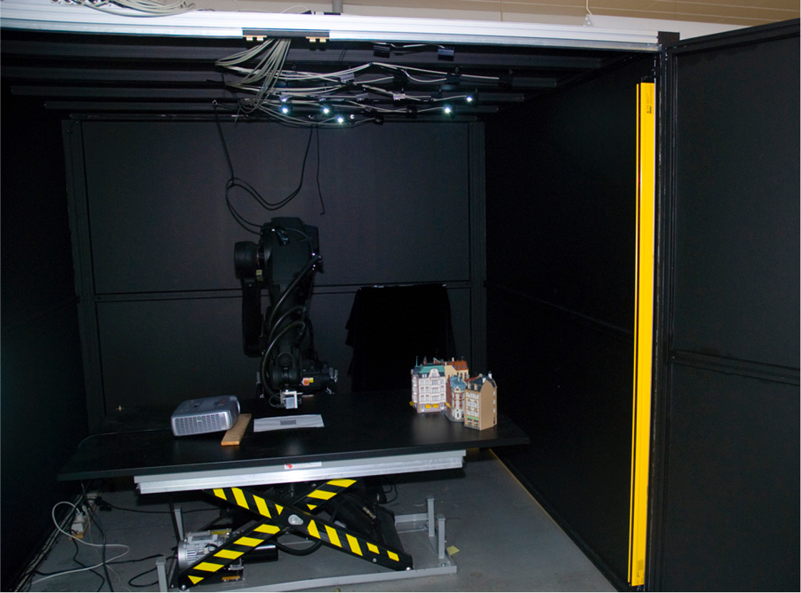
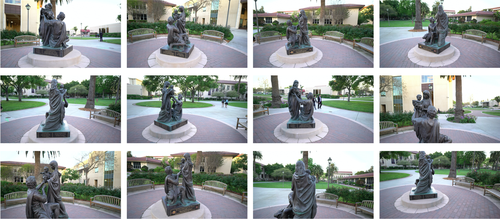
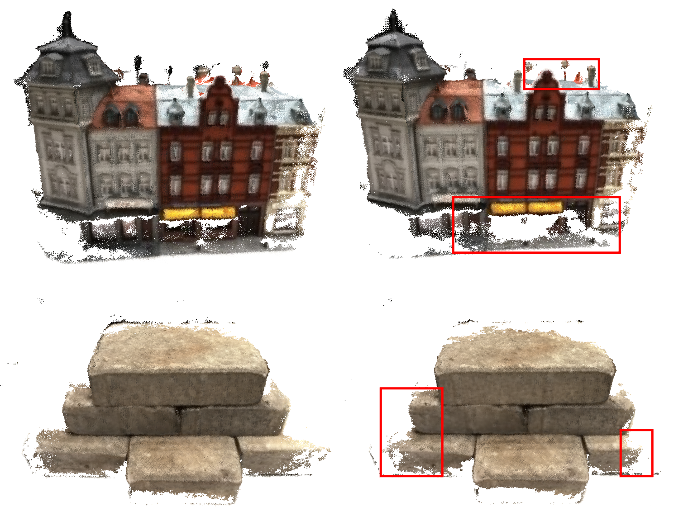
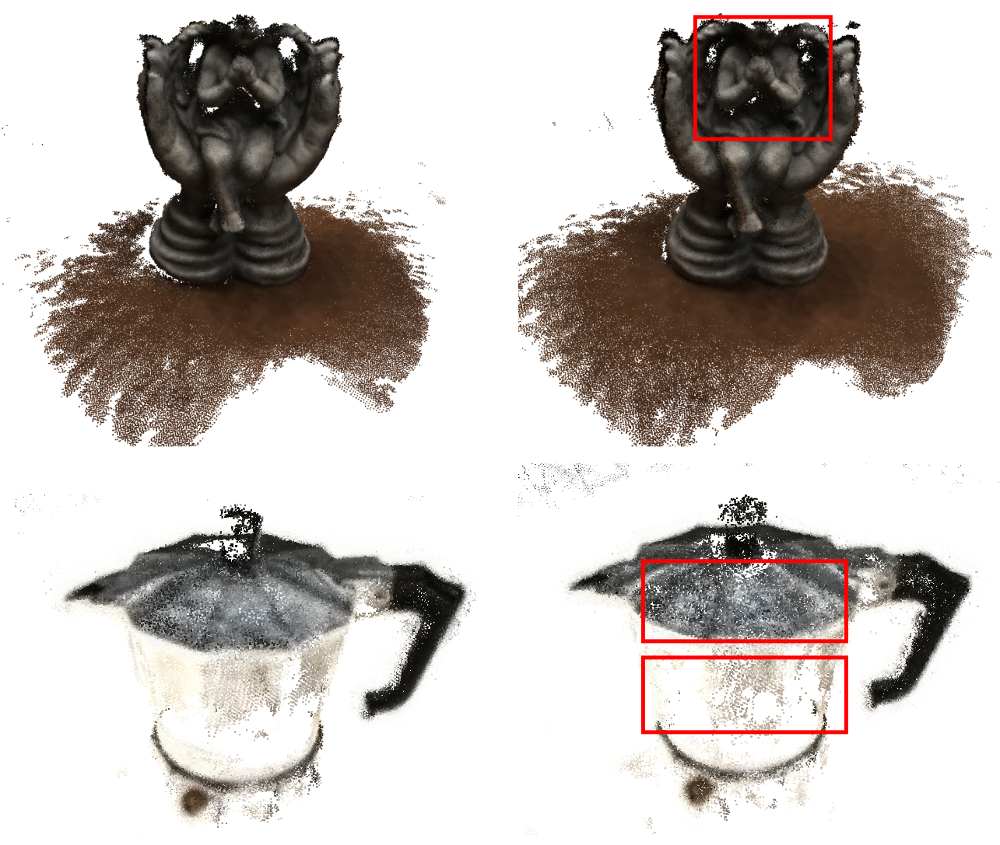
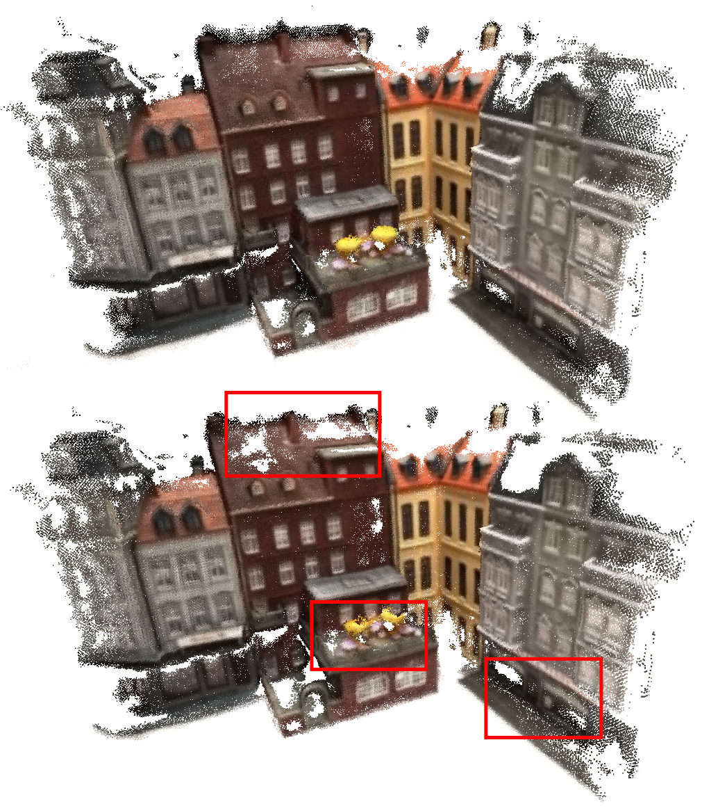
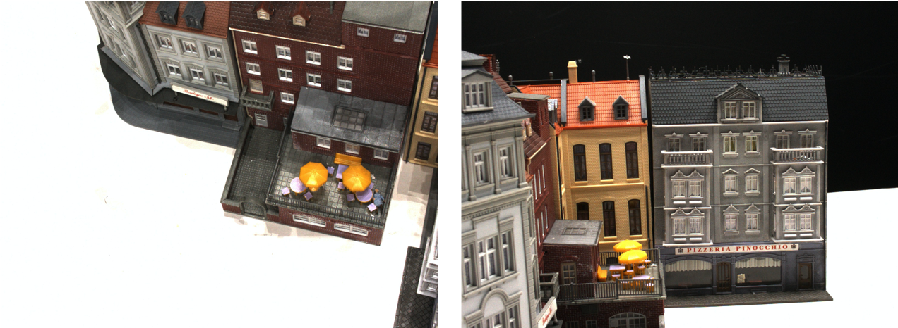
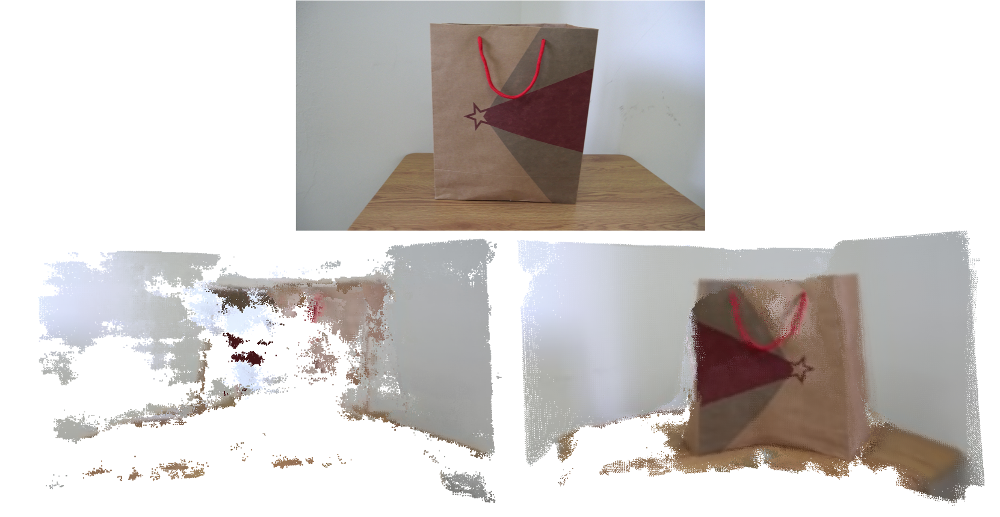

# 第五章 实验结果与评估

------

​		本章将主要介绍笔者进行的相关无监督多视点三维重建实验，包括实验环境、实验数据集等配置信息，在不同数据集上的重建效果，消融实验，以及对于实验的评估等内容，一些实现细节已在第4章之处，这里不在赘述。

 

## 5.1 实验环境与数据集简介

### 5.1.1 实验环境

​	本实验所使用的开发环境和主要依赖包参数分别如表5.1和表5.2所示。

​	需要说明的是由于本文进行多种方法的对比实验，因此通过Docker将不同方法打包成不同的镜像以互不影响，依赖包参数说明的仅为无监督学习方法的依赖环境。

> 表5.1 开发环境

|      类型      |    名称     |     版本 / 型号     |              说明              |
| :------------: | :---------: | :-----------------: | :----------------------------: |
|     服务器     |   Ubuntu    |     16.04.6 LTS     |         amd64体系架构          |
|      显卡      |   NVIDIA    | GeForce RTX 2080 Ti |     cuda V10.0，cudnn V7.0     |
|    开发语言    |   Python    |       V2.7.12       |  充分适配Tensorflow-GPU的版本  |
|  深度学习框架  | Tensorflow  |       V1.13.1       |       版本由显卡内核决定       |
| 三维可视化平台 | MeshLab[32] |      V2020.12       |    开源的点云模型可视化软件    |
|      IDE       |   VSCode    |       V1.56.1       |       Python集成开发环境       |
|    容器技术    |   Docker    |      V20.10.5       | 将不同方法环境打包成独立的镜像 |
|      SFTP      |  CyberDuck  |       V7.9.0        |     SFTP远程连接服务器软件     |
|    版本控制    |     Git     |       V2.24.3       |    开源的分布式版本控制工具    |

>  表5.2 主要依赖包参数

|      名称      |   版本   |                说明                |
| :------------: | :------: | :--------------------------------: |
| tensorflow-gpu | V1.13.1  |    Tensorflow在GPU下的依赖环境     |
|     numpy      |  V1.13   |       Python科学计算依赖环境       |
| opencv-python  | V3.2.0.8 | Python使用计算机视觉算法的依赖环境 |
|  scikit-learn  |  V0.18   |          Python机器学习库          |
|     scipy      |  V0.18   |          Python机器学习库          |
|   matplotlib   |   V1.5   |   Python绘图及数据可视化依赖环境   |
|     Pillow     |  V3.1.2  |          Python图像处理库          |
|  nvidia-ml-py  | V375.53  |       NVIDIA GPU管理依赖环境       |

### 5.1.2 实验数据集

​	本实验参照MVS相关问题的最佳实践，采用DTU数据集进行训练和测试，并在Tanks and Temples数据集上进行泛化能力测试，最后通过自采数据集验证该方法在真实实践中的可使用性。接下来笔者将分别介绍这三类数据集。

**A. DTU数据集**

​	DTU数据集\[33]\[34]是针对MVS问题而专门拍摄并处理的室内物体数据集，利用一个搭载可调节照明的ABB工业机械臂对物体进行多视点拍摄，如图5.1所示。所有物体拍摄的视角都经过严格控制，因此可以精准的获得每个视角下相机的内参和外参的精准值。

> 图5.1 拍摄DTU数据集所使用的ABB机械臂和拍摄环境

​	数据集中共由124个不同的物体或场景组成，如图5.2上图所示。每个物体共拍摄49个不同的视角，每个视角共有7种不同的亮度，如图5.2下图所示。每个物体或场景数据集中共有343张图片，每张图像分辨率为$1600 \times 1200$。

> 图5.2 DTU数据集中部分物体或场景（上）和DTU数据集scan34场景中的部分视角（下）
>

**B. Tanks and Temples数据集**

​	Tanks and Temples数据集是Arno Knapitsch等人[3]提出的基准测试中所采集的大型室外场景数据集，数据的真值使用工业激光扫描仪获得，同时支持使用视频作为输入以提高重建保真度。但该数据集一般不作为训练使用，而是用于验证方法对光照变化大、存在动态目标的真实场景的泛化能力。其部分场景和视点图像如图5.3所示。

> 图5.3 Tanks and Temples数据集Family场景中的部分视角

**C. 自采数据集**

​	实验中还使用自采数据集进行真实实践的可用性测试，在进行自采图像收集时应注意以下四点：

（1）使用单反或专业数码相机进行数据采集，如果使用手机采集图像，要使用单摄像头手机或对其他摄像头进行遮挡后再进行采集

（2）选择纹理丰富的环境进行图像采集，尽量避免玻璃、瓷砖等强反光场景的影响

（3）选择光照充足且光照条件变换不剧烈的环境，最好选择室内环境且打开室内大灯进行灯光补偿

（4）围绕待重建物体或场景采集较多的图像，在采集过程中控制快门速度，避免模糊，如果使用视频进行抽帧操作得到图像序列，同样需要避免抽帧图像模糊

 

## 5.2 实验结果

​	参考3D几何约束的方法，笔者针对公式4.9采用的权重为$\alpha=12$，$\beta = 6$，$\gamma = 0.18$进行最终重建效果的展示，在GPU上共训练200000轮。

​	本节将依次展示笔者的无监督多视点三维重建方法在DTU数据集和Tanks and Temples数据集上的重建效果，重建后得到ply格式的点云文件，再通过Meshlab软件进行可视化。

### 5.2.1 DTU数据集上重建的效果

​	在DTU数据集的测试集中选取场景9、15、23、24、34、77、114、118进行测试，这些测试都与真实土木工程场景较为相似，通过特殊测试数据的选择可以更加直观反映本方法对土木工程真实场景的三维重建能力。

> 图5.4 DTU数据集中建筑模型的重建效果

> 图5.5 DTU数据集中部分其他模型的重建效果

​	图5.4中全部为建筑楼房的模型场景，该类场景在重建中由于遮挡等问题一直是难度极大的挑战，在无监督学习方法没有真值作为训练依照的情况下，通过鲁棒的光度一致性仍可以进行较大程度的复原与重建，足可见该方法的可靠性。但重建的边缘部分仍然存在很多漏洞与离群点，这是由于在稠密重建之后并没有进行任何额外的滤波和微调，如果再使用例如点云库（Point Cloud Library，简称PCL）中经典的点云聚类和滤波算法可以得到更加精致完整的点云模型。需要注意的是，在土木工程建筑这类大型场景，多视图的实际获取往往是以相机为中心，通过视角的转换和覆盖即可以做到场景的图像覆盖，这类多视图采集方法在真实使用中更为方便，也有更广阔的应用前景。

​	图5.5中主要为土木工程领域中单物体的模型场景，这类场景在多视点采集时往往以场景中物体为中心，通过移动和旋转相机进行多视图的采集。从重建效果来看整体漏洞和离群值较少，已经具有相当的完整性和可使用性。在一些点云处理软件中可以进一步框选所感兴趣深度或范围的点云群并提取再渲染，因此可以进一步做到精细化。

### 5.2.2 Tanks and Temples数据集上重建的泛化效果

​	在Tanks and Temples数据集的测试集中选取场景Family、Train、Hourse进行测试，这些测试集能更好的反映土木工程领域在室外真实作业时的大规模场景变化和光照变化等。

> 图5.6 Tanks and Temples数据集中部分场景的重建效果

​	Tanks and Temples数据集中的场景的视点数量较多，普遍为200以上，且采集时并没有可控的光照和遮挡处理，并且背景也会对待重建主体造成很大程度上的影响。同样基于无监督学习的单目或双目方法对该数据集中场景几乎无法进行有效的重建，而基于鲁棒光度一致性的无监督学习多视点方法可以进行一定精度和完整性的重建，这已经是很大程度上的突破。但是从重建效果中也可以看到相较于DTU数据集中精细化拍摄的多视点图片，在光照剧烈变换且遮挡不可控的场景中，重建效果还有很大的提升空间。需要注意的是，笔者所用的方法在训练时完全未使用该数据集作为训练样本，但仍能该数据集上取得一定的泛化效果。

 

## 5.3 消融实验

​		本节将就4.2节提出的鲁棒的光度一致性和4.3节提出的无监督损失函数进行消融实验，以验证无监督学习多视点三维重建方法中自监督损失函数的作用。本节将依次对结构化相似性损失SSIM、平滑损失Smooth和遮挡策略中提出的$top-K$进行消融处理，并结合无监督深度神经网络在DTU数据集上各自训练40000轮。之后对DTU测试集中的部分场景进行三维重建并比较结果，以分析各部分的影响。

### 5.3.1 误差项的影响

**A. 结构化相似性损失SSIM**

> 图5.7 鲁棒的光度一致性（左）和消融SSIM误差（右）的重建结果对比

​		根据公式4.6和4.7，结构化相似性损失SSIM可根据结构性的相似之处进行完整性方面的更强约束，使得可以跟随相似特征做到更加完整的重建。从图5.7中也可以看到，在场景一的路面、房檐橙色的新建筑；场景二的方砖边缘等都存在大量相似的结构。而消融掉SSIM损失后难以根据结构上的关系进行这些部分的重建，造成完整性的下降。

​		同时从图中我们可以看到SSIM从场景的边缘进行初始化，即场景的部分稀疏边缘被首先确定下来，然后根据相似性判据向内迭代扩展。

**B. 平滑损失Smooth**

>  图5.8 鲁棒的光度一致性（左）和消融Smooth误差（右）的重建结果对比

​		根据公式4.8及图像处理中的平滑知识可知，平滑损失Smooth主要进行点云平滑滤波，尤其是边缘的平滑处理。从图5.7中也可以直观观察到，消融Smooth误差后，场景一雕塑的边缘存在很多噪声，且有较多离群点分散于主体中间；场景二由于曝光度过高，杯盖存在严重杂乱的噪声，且杯壁由于没有进行逐次的平滑累计处理而重建不完全。

### 5.3.2 遮挡视点剔除的影响

>  图5.9 top-K策略为3（上）和top-K策略为6（下）的重建结果对比

>  图5.10 场景中遮挡关系示意图

​		4.2.2节中通过$top-K$策略改善传统光度一致性约束中要求场景中的每个像素都要在参考图像和所有原始图像中满足基于单应投影变换的光度一致性。根据公式4.5，只需要满足像素在非遮挡图像中的光度一致性就可以更加准确也更加鲁棒的实现匹配。但由于根据聚类或其他方法的思想动态调整$K$值会较大程度地影响算法整体性能与复杂度，因此在具体实现中通过比较不同$top-K$值的结果进行调参。

​		当$top-K$分别为3和6时重建结果如图5.9所示。由于在实现中取每个参考图像对应的新视点原始图像为6，则当$top-K=6$时意味需要满足图像的光学一致性需要在所有原始图像中得到满足。可以看到如果需要满足所有视点的光学一致性会造成比较严重的空洞现象，这是由于不同视点在上述区域的可见性差别很大，在有些视点中这些区域很可能处于不可见位置，如图5.10所示。在左图中场景右侧的黑色房子下方不可见，在右图中场景中间红色房子房顶和黄色遮阳伞部分不可见，如果在这些视图中也强行进行光度一致性配准，则会造成错误的深度值估计和重建效果等。

 

## 5.4 实验评估

​	本节将对无监督学习多视点三维重建的实验效果进行评估，主要参考多视点三维重建问题的经典评估手段，并与第3章着重分析的传统计算机视觉Colmap方法和有监督学习多视点三维重建方法进行对比。

​	需要说明的是，笔者采用的无监督学习方法在相同或相似的条件下无法与基于计算机视觉的传统方法或有监督学习方法媲美，因在训练过程中无监督学习方法依照的损失函数是通过数学公式和经验推导的，而有监督学习方法依照的损失函数直接为预先给定的场景三维信息真值；无监督学习方法是通过自拟合数据集中的训练数据并进行一定程度的泛化，而传统方法是依照严格的数学推导的。但无监督学习方法的意义更为深远，尤其是在土木工程场景的背景下，随着数据规模的增大和待重建场景的复杂化，传统方法的低性能和有监督学习方法真值数据的难获得都将成为三维重建问题极大的障碍，而无监督学习方法可以充分利用大量获取的无真值的数据进行特定场景的训练，在性能和可用性上极具优势。

### 5.4.1 定性评估

​	定型评估中，笔者将所采用的无监督多视点三维重建方法与传统Colmap方法和有监督学习MVSNet重建结果进行横向比较，结果如图5.9所示，从左到右依次为Colmap方法、MVSNet方法和无监督学习方法。

> 图5.11 无监督方法（右）与Colmap（左）和MVSNet（中）方法的重建结果比较

**A. 与传统Colmap方法对比**

​	从感官上，Colmap方法重建结果是最完整且精度最高的，这与Colmap的原理有极大的关系，作为基于传统计算机视觉的方法，充分在对极几何上施加严格的数学约束以进行平面扫描和立体匹配。在基于深度学习方法难以重建的稀疏表面或大幅度遮挡位置，如场景二中两楼遮挡区域，仍能进行较为完整的三维点云重建。但Colmap方法在处理场景和物体边缘时由于视觉特征无法进行有效渐进式的传播，即边缘区域往往是稀疏重建时的边界值，因此在图中所示结果的边缘区域相较于深度学习方法存在一定差距，如场景三中最上方砖块的边缘位置存在着较为强烈的噪声。

​	在具体操作Colmap进行实验时，传统方法的时间消耗是不容忽视的，在一般多视点场景的三维重建尤其是稠密筹建步骤，所花费的时间是深度学习方法的1000倍～10000倍，尤其是场景一、二所示的大型场景耗时将更长，这对于土木工程普遍存在的大规模场景是极难接受的。

**B. 与有监督深度学习MVSNet方法对比**

​	与其他深度学习问题相同，有监督学习方法依靠对场景真值进行拟合，在相仿场景下进行测试的结果确实较无监督学习方法结果出色一筹。尤其是图中场景一下排的路面和树木、场景五中佛像下方被严重遮挡的桌面，在有真值的监督下MVSNet可以进行更精准的复原。

​	但如第1章和第3章提到的，有监督学习方法在泛化性上与无监督方法存在很大的差距，如图5.10所示。在此场景的多视点采集时，待重建物体与背景墙距离很近，纸袋几乎处于同一水平面且特征单一，加之场景前后光照变换较大。有监督学习方法在训练集中没有相似场景的监督下很难进行重建，其效果如图中第二排第一幅点云效果所示，除右侧光照变化不大的墙面以外，对场景重建效果很不理想。而无监督学习方法受鲁棒的光度一致性约束，在此自拍摄场景中表现极为优秀，足见其强大的泛化性。

​	除此之外，无监督学习方法也有更高的可扩展性。由于土木工程场景极难获取真值，有监督学习方法较难进行扩展。

> 图5.12 真实场景中有监督学习方法（左）和无监督学习方法（右）对比

### 5.4.2 定量评估

​	定量评估策略主要参考MVSNet中提到两个大方向，分别是距离度量（mm）和百分比度量（<1mm），共计四种度量指标：

（1）准确性（accuracy，简称Acc.）：衡量预测的深度值与真值间平均误差的度量指标

（2）完整性（completeness，简称Comp.）：衡量重建点云完整度的度量指标

（3）总体性（overall）：准确性与完整性的平均值

（4）f值（f-score）：综合准确性和完整性的度量指标

​	将笔者所训练的无监督学习方法对DTU数据集中的测试集进行三维重建，将生成的22个点云文件通过DTU数据集官方提供的MATLAB脚本进行定量评估。同时参考其他方法对于同样测试集的定量结果，汇总得到表5.3和表5.4。

>  表5.3 不同三维重建方法在DTU测试集上的距离度量（*mm*）定量评估结果

| 方法名称           | Acc.  | Comp. | overall |
| ------------------ | ----- | ----- | ------- |
| SurfaceNet         | 0.450 | 1.043 | 0.746   |
| MVSNet             | 0.444 | 0.741 | 0.592   |
| 经典光度一致性方法 | 1.565 | 1.378 | 1.472   |
| 无监督学习方法     | 1.255 | 1.491 | 1.373   |

>  表5.4 不同三维重建方法在DTU测试集上的百分比度量（<1*mm*）定量评估结果

| 方法名称           | Acc.  | Comp. | f-score |
| ------------------ | ----- | ----- | ------- |
| SurfaceNet         | 75.73 | 59.09 | 66.38   |
| MVSNet             | 82.93 | 62.71 | 71.42   |
| 经典光度一致性方法 | 46.90 | 42.16 | 44.40   |
| 无监督学习方法     | 61.54 | 44.98 | 51.98   |

​	在该表中距离度量指标越小代表效果越好，百分比指标越大代表效果越好。将无监督学习方法与SurfaceNet和MVSNet进行横向比较确实存在一定差距，尤其是与MVSNet进行比较。但需要注意的是，对于相似的网络架构，笔者所采用的方法不依赖场景的真值，而MVSNet仅是通过场景的真值在训练能使DTU数据集损失最小的方法。而与经典的光度一致性方法进行比较发现，笔者采用的鲁棒性的光度一致性确实对点云重建的结果有较大的影响，如果采取更大的未标注数据集训练相信会有更好的结果。

